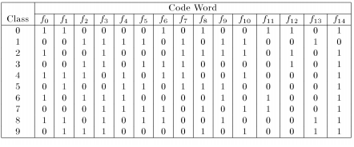
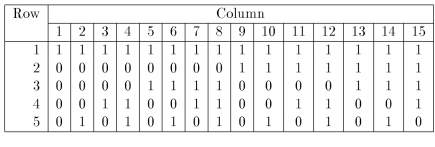

## Error-Correcting Output Coding


#### David Solans 
#### Huang Chen


This notebook extends the notebook posted by David Solans in his github: 
 https://github.com/dsolanno/UBDataScience-Machine-Learning/blob/master/Error%20Correcting%20Output%20Codes%20(ECOC)/Error%20Correcting%20Output%20Coding.ipynb

### 1 Introduction
Error-Correcting Output Codes(ECOC) is an ensemble method designed for
multi-class classification problem. In multi-class classification problem, the task
is to decide one label from $k > 2$ possible choices. 

For example, in digit recognition task, we need to map each hand written digit to one of $k = 10$ classes.
Some algorithms, such as decision tree, naive bayes and neural network, can
handle multi-class problem directly.
ECOC is a meta method which combines many binary classifiers in order to
solve the multi-class problem.


<p style="text-align: center;">Figure 1: A 15 bit error-correcting output code for a ten-class problem</p>

Figure 1 shows a 15 bit error-correcting output code for a ten-class problem.

Each class is assigned a unique binary string of length 15. The string is also
called a codeword. For example, class 2 has the codeword $100100011110101$.
During training, one binary classifier is learned for each column. For example,
for the first column, we build a binary classifier to separate ${0, 2, 4, 6, 8}$ from
${1, 3, 5, 7, 9}$. Thus 15 binary classifiers are trained in this way. To classify a
new data point x, all 15 binary classifiers are evaluated to obtain a 15-bit string.
Finally, we choose the class whose codeword is closet to x’s output string as the
predicted label.

### 2 Theoretical Justification
Notice that in the error-correcting output code, the rows have more bits than
is necessary. $log_2 10 = 4$ is enough for representing 10 different classes. Using
some redundant ”error-correcting” bits, we can tolerant some error introduced
by finite training sample, poor choice of input features, and flaws in the training
algorithm. Thus the system is more likely to recover from the errors. If the
minimum Hamming distance between any pair of code words is d, then the code
can correct at least $|\frac{d−1}{2}|$ single bit errors. As long as the error moves us fewer
than $|\frac{d−1}{2}|$ unit away from the true codeword, the nearest codeword is still the
correct one. The code in Figure 1 can correct up to 3 errors out of the 15 bits.

### 3 Code design
There are many ways to design the error-correcting output code. We can list the following 4 different method for constructing good error-correcting output codes

1. Exhaustive codes. It is applied when $3\leq k <7$
2. Column Selection from exhaustive codes for $8 \leq k \leq 11$
3. Randomized hill climbing and Bose-Chaudhuri-Hocquengham(BCH) codes when $k>11$.

Besides, random generation of the codewords is a recommended method by the reference [http://www.jair.org/vol/vol2.html]("Solving  multiclass  learning  problem  via  error-correcting  output codes," Journal of Artificial Intelligence Research, vol. 2, pp. 263–286, 1995.)


Here we introduce each of the above methods. But we give a simple example to focus on exhaustive codes.

**1.Exhaustive Codes **

When the number of classes k is small $(3 < k ≤ 7)$, we can use exhaustive
codes. Each code has length $2^{k−1}−1$. 

- Row 1 contains only ones. 

- Row 2 consists
of $2^{k−2}$ zeros followed by $2^{k−2} − 1$ ones.

- Row 3 consists of $2^{k−3}$ zeros, followed
by $2^{k−3}$ ones, followed by $2^{k−3}$
zeros, followed by $2^{k−3} −1$ ones. 

Figure 2 shows
the exhaustive code for a five-class problem. The code has inter-row Hamming
distance 8.
When the number of classes k is large, random codes can be used. The major benefit of error-corrective coding is variance reduction via model averaging. Random code works as well as optimally
constructed code.


<p style="text-align: center;">Figure 2: Exhaustive code for a five class problem</p>

**2.Column Selection from exhaustive codes for **

When $8\leq k\leq 11$, we construct an exhaustive code and then select a good subset of  its columns.
We formulate this as a propositional satisability problem and apply the GSAT algorithm (Selman,Levesque, &Mitchell,1992) to attempt a solution. A solution is required to include exactly $L$ columns(the desired length of the code) while ensuring that the Hamming distance between every two columns is between $d$ and $L$ exclusion constraint is placed between any two columns that violate the column separation condition. To support these constraints, we
extended GSAT to support mutual exclusion and "m-of-n" constraints efficiently.

**3. Randomized hill climbing and Bose-Chaudhuri-Hocquengham(BCH) codes **

**Randomized hill climbing**

For $k>11$, we employed a random search algorithm that begins by drawing $k$ random strings of the desired length $L$. Any pair of such random strings will be separated by a Hamming distance that is binomially distributed with mean $L=2$.
Hence, such randomly generated codes are generally quite good on average. To improve them,the algorithm repeatedly finds the pair of rows closest together in Hamming distance and the pair of columns that have the "most extreme" Hamming distance (i.e.,either too close or too far apart). The algorithm then computes the four codeword bits where these rows and columns intersect and changes them to improve the row and column separations as shown in the below figure. When this hill-climbing procedure reaches a local maximum, the algorithm randomly chooses pairs of rows and columns and tries to improve their separations. This combined hill-climbing/random-choice procedure is able to improve the minimum Hamming distance separation quite substantially.


<p style="text-align: center;">Figure 3: random_hill_climbing for
improving row and column separation. The two closest rows and columns are indicated by lines.Where these lines intersect, the bits in the codewords are changed to improve separations as shown on the right.</p>

**Bose-Chaudhuri-Hocquengham(BCH)**

For $k>11$ we can also applied the BCH algorithm to design codes (Bose & Ray-Chaudhuri, 1960;Hocquenghem,1959). The BCH algorithm employs algebraic methods from Galois field theory to design nearly optimal error-correcting codes. However, there are three practical drawbacks to using this algorithm. First, published tables of the primitive polynomials required by this algorithm only produce codes up to length 64, since this is the largest word size employed in computer
memories. Second, the codes do not always exhibit good column separations. Third, the number of rows in these codes is
always a power of two. If the number of classes $k$ in our learning problem is not a power of two, we must shorten the code by deleting rows (and possible columns) while maintaining good row and column separations. 


**We can find more details about the about method, also some real experiment in the following article:[https://www.jair.org/media/105/live-105-1426-jair.pdf](The above descriptions come from this article)**


### 4 Working with ECOC in python

We will use the class:
<br>
<a href="http://scikit-learn.org/stable/modules/generated/sklearn.multiclass.OutputCodeClassifier.html"> sklearn.multiclass.OutputCodeClassifier</a>

In OutputCodeClassifier, the `code_size` attribute allows the user to control the number of classifiers which will be used. It is a percentage of the total number of classes.

A number between 0 and 1 will require fewer classifiers than one-vs-the-rest. In theory, `log2(n_classes) / n_classes` is sufficient to represent each class unambiguously. However, in practice, it may not lead to good accuracy since `log2(n_classes)` is much smaller than n_classes.


```python
from sklearn import datasets
from sklearn.multiclass import OutputCodeClassifier
from sklearn.svm import LinearSVC
iris = datasets.load_iris()
X, y = iris.data, iris.target
clf = OutputCodeClassifier(LinearSVC(random_state=0),
                           code_size=2, random_state=0)
yhat=clf.fit(X, y).predict(X)
print(yhat)
accuracy_score(yhat, y)
```

    [0 0 0 0 0 0 0 0 0 0 0 0 0 0 0 0 0 0 0 0 0 0 0 0 0 0 0 0 0 0 0 0 0 0 0 0 0
     0 0 0 0 0 0 0 0 0 0 0 0 0 1 1 1 1 1 1 2 1 1 1 1 1 1 1 1 1 2 1 1 1 2 1 1 1
     1 1 1 2 1 1 1 1 1 2 2 2 1 1 1 1 1 1 1 1 1 1 1 1 1 1 2 2 2 2 2 2 2 2 2 2 2
     2 2 2 2 2 2 2 2 1 2 2 2 2 2 2 2 2 2 1 2 2 2 1 1 2 2 2 2 2 2 2 2 2 2 2 2 2
     2 2]
    


    0.92666666666666664


We set a litter bitt higher value on the code_size, then we get a higher accuracy 


```python
from sklearn import datasets
from sklearn.multiclass import OutputCodeClassifier
from sklearn.svm import LinearSVC
import numpy as np
from sklearn.metrics import accuracy_score
iris = datasets.load_iris()
X, y = iris.data, iris.target
clf = OutputCodeClassifier(LinearSVC(random_state=0), code_size=15, random_state=0)
yhat=clf.fit(X, y).predict(X)
yhat
```


    array([0, 0, 0, 0, 0, 0, 0, 0, 0, 0, 0, 0, 0, 0, 0, 0, 0, 0, 0, 0, 0, 0, 0,
           0, 0, 0, 0, 0, 0, 0, 0, 0, 0, 0, 0, 0, 0, 0, 0, 0, 0, 0, 0, 0, 0, 0,
           0, 0, 0, 0, 1, 1, 1, 1, 1, 1, 1, 1, 1, 1, 1, 1, 1, 1, 1, 1, 1, 1, 1,
           1, 2, 1, 1, 1, 1, 1, 1, 1, 1, 1, 1, 1, 1, 2, 1, 1, 1, 1, 1, 1, 1, 1,
           1, 1, 1, 1, 1, 1, 1, 1, 2, 2, 2, 2, 2, 2, 2, 2, 2, 2, 2, 2, 2, 2, 2,
           2, 2, 2, 2, 2, 2, 2, 2, 2, 2, 2, 2, 2, 2, 2, 2, 2, 2, 1, 2, 2, 2, 2,
           2, 2, 2, 2, 2, 2, 2, 2, 2, 2, 2, 2])


```python
y
```


    array([0, 0, 0, 0, 0, 0, 0, 0, 0, 0, 0, 0, 0, 0, 0, 0, 0, 0, 0, 0, 0, 0, 0,
           0, 0, 0, 0, 0, 0, 0, 0, 0, 0, 0, 0, 0, 0, 0, 0, 0, 0, 0, 0, 0, 0, 0,
           0, 0, 0, 0, 1, 1, 1, 1, 1, 1, 1, 1, 1, 1, 1, 1, 1, 1, 1, 1, 1, 1, 1,
           1, 1, 1, 1, 1, 1, 1, 1, 1, 1, 1, 1, 1, 1, 1, 1, 1, 1, 1, 1, 1, 1, 1,
           1, 1, 1, 1, 1, 1, 1, 1, 2, 2, 2, 2, 2, 2, 2, 2, 2, 2, 2, 2, 2, 2, 2,
           2, 2, 2, 2, 2, 2, 2, 2, 2, 2, 2, 2, 2, 2, 2, 2, 2, 2, 2, 2, 2, 2, 2,
           2, 2, 2, 2, 2, 2, 2, 2, 2, 2, 2, 2])


```python
accuracy_score(yhat, y)
```


    0.97999999999999998


